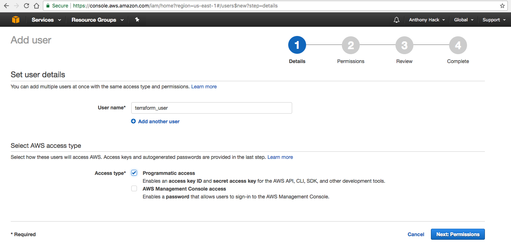
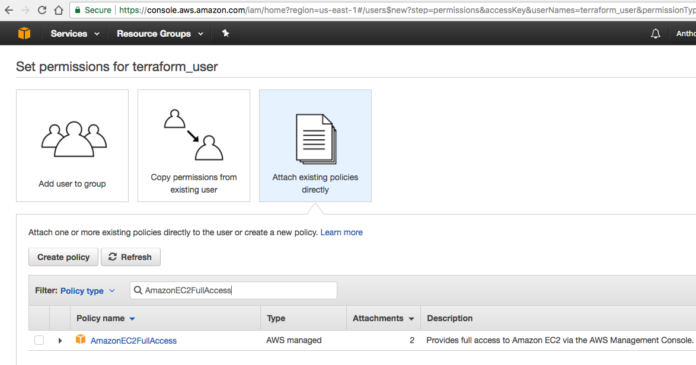
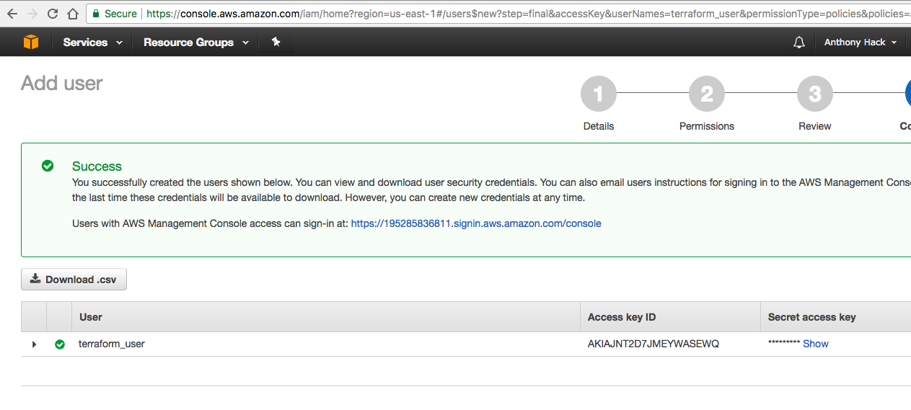

# Datadog technical exercise for Solutions Engineers

Datadog is a full service cloud-scale monitoring solution that gathers metrics and events generated by both your infrastructure
as well as your applications. From containers, to cloud providers, to bare metal machines, from container management, to databases, to web servers,
Datadog is able to handle most modern infrastructure solutions.

Datadog provides a wide array of integrations that can handle common infrastructure needs. These integrations allow you to gather metrics 
quickly and in one central location. All metrics and statistics datadog gathers can be displayed in a single pane of glass which can be on a single
screen in a NOC or other operations center. These metrics can be turned into graphs and dashboards which can then be drilled down into further for 
a more detailed look at your infrastructure. Alerts can also be created to warn your teams that something is wrong before it becomes a larger problem.
Alerts can be sent in a variety of ways, including email, pagerduty, slack, hipchat, and others.

You can test datadog out yourself here [https://www.datadoghq.com/](https://www.datadoghq.com/) for a free 14 day trial.

## Contents

- [Prerequisites](#Prerequisites)
   - [Setup an AWS user for Terraform](#Setup-an-AWS-user-for-Terraform)
   - [Install Terraform](#Install-Terraform)
   - [Install Ansible](#Install-Ansible)

- [Data Collection](#Data-Collection)
   - [Level 0 - Setup a ubuntu instance](#Level--0--Setup-a-ubuntu-instance)
      - [Auto build EC2 instance with Terraform](#Auto-build-EC2-instance-with-Terraform)

   - [Level 1 - Collect your data](#Level--1--Collect-your-data)
      - [Auto installing the agent with Ansible](#Auto-installing-the-agent-with-Ansible)
      - [Bonus: What is the agent?](#Bonus--What-is-the-agent?)
      - [Adding tags](#Adding-tags)
      - [Auto install MySQL with Ansible](#Auto-install-MySQL-with-Ansible)
      - [Custom Agent Check](#Custom-Agent-Check)

   - [Level 2 - Visualizing your data](#Level--2--Visualizing-your-data)
      - [Clone your database integration dashboard](#Clone-your-database-integration-dashboard)
      - [Bonus: What is the difference between a timeboard and a screenboard?](#Bonus--What-is-the-difference-between-a-timeboard-and-a-screenboard?)
      - [Grab a snapshot of your test random graph, draw a box when above 0.90 and email](#Grab-a-snapshot-of-your-test-random-graph,-draw-a-box-when-above-0.90-and-email)

   - [Level 3 - Alerting on your data](#Level--3--Alerting-on-your-data)
      - [Monitoring your metrics, set an alert for test random for over 0.90](#Monitoring-your-metrics,-set-an-alert-for-test-random-for-over-0.90)
      - [Bonus: Make it multi-alert by host for scalability](#Bonus--Make-it-multi-alert-by-host-for-scalability)
      - [Set monitor name and message](#Set-monitor-name-and-message)
      - [Monitor alert Email](#Monitor-alert-Email)
      - [Bonus: Set scheduled downtime for monitor, make sure Email is notified](#Bonus--Set-scheduled-downtime-for-monitor,-make-sure-Email-is-notified)

# Prerequisites

## Setup an AWS user for Terraform

- Setting up an AWS user for Terraform [Amazon Web Services(AWS)](https://aws.amazon.com/) is the leading cloud compute provider. 
  They offer a wide range of infrastructure services.
- Create a user in IAM, there are three steps to follow to create an IAM user to use with Terraform. 
- One, give the user a name and make sure they have programmatic access only. There's no need for console access with Terraform.



- Two, in order to have Terraform create our EC2 instance we'll need the proper AWS permissions. For this user they will need only 
  **AmazonEC2FullAccess** in order to create and destroy EC2 instances.



- Finally, You will need both the access and secret keys for the user. These will be used at runtime so as to not save them in a file and cause a security risk.



## Install Terraform

- [Installing Terraform](https://www.terraform.io/downloads.html) Terraform is much more then just a configuration managment tool. It lets you define your 
  infrastructure as code. Download it for your appropriate OS.

- Download the correct version of Terraform for your OS, I have downloaded **terraform_0.10.3_darwin_amd64.zip** for MacOSX. Unzipping inflates the file you then move that file 
  to somewhere that is in your PATH. I have moved the file to **/usr/local/bin** which lets me access the terraform command directly.

## Install Ansible

- [Installing Ansible](http://docs.ansible.com/ansible/latest/intro_installation.html) Ansible is an open source configuration management tool. Powerful but yet extremely simple to use.
  Ansible can handle not only configuration mangagement but applicaion deployments, and task automation. Installation instructions are dependent on OS used.

- Since I am installing on MacOSX I will be using pip which is python's package manager. You can install pip by downloading this file [Pip](https://bootstrap.pypa.io/get-pip.py) 
  and running python get-pip.py. 

- Now that you have pip you can install ansible by simply running **sudo pip install ansible** this will install ansible and a series of other applications. We'll mainly concentrate on 
  ansible-playbook.

# Data Collection

 ## Level 0 Setup an Ubuntu Instance

  ## Auto build EC2 instance with Terraform

	- We will auto build our EC2 instance that will run our database, as well as our datadog agent. This will be a t2.large EC2 instance in AWS. We will build this with Terraform
	
	- The code below will build our instance for us.
	
	```terraform
	provider "aws" {
	  access_key    = "${var.access_key}"
	  secret_key    = "${var.secret_key}"
	}   
	   
	resource "aws_instance" "Datadog_Tech_Example" {
	  ami                         = "ami-cd0f5cb6"
	  instance_type               = "t2.large"
	  associate_public_ip_address = true
	  key_name                    = "DD_Testing"
	  vpc_security_group_ids = [
	      "sg-033ebf73"
	  ]
	
	  tags {
	    Name = "Datadog_Tech_Example"
	  }
	
	  provisioner "local-exec" {
	    command = "sleep 120; ANSIBLE_HOST_KEY_CHECKING=False AWS_ACCESS_KEY=${var.access_key} AWS_SECRET_KEY=${var.secret_key} ansible-playbook /Users/hack/dd_solution_engineer/ansible/Tasks/main.yml -u 	ubuntu --private-key /Users/hack/.ssh/DD_Testing.pem -i '${aws_instance.Datadog_Tech_Example.public_ip},'"
	  }
	}
	```
	
	- A short overview of the code above, we set the provider to be AWS (terraform can also be used with other cloud providers such as google). For the access and secret keys we will use the ones we
	  generated earlier for the user. These will be input during run-time. We are going to build an aws_instance resource called **Datadog_Tech_Example**, we are using the Ubuntu 16.04 AMI,
	  its size will be t2.large, we will give it a public IP address, and access it using a previously created ssh key. The newly created instance will be associated with a previously created
	  security group that grants SSH access as well as access for the datadog agent to communicate on port 8125. Finally we tag it with a Name so we can see it in the AWS Console. We will go over the
	  provisioner portion in the next step when we install both a MySQL database as well as the datadog agent itself.

 ## Level 1 Collect your data

  ## Auto installing the agent with Ansible

    - We will use Ansible to install the agent on our host automatically. This will tie in with Terraform, we will create an ansible playbook that will be run by Terraform when our EC2 instance
      is created.

    ```yaml
    ---
	- hosts: all
	  become: true
	  gather_facts: False
	  tasks:
	
	    - name: Run dd-agent install script
	      raw: DD_API_KEY=XXXXXXXXXXXXXXXXXXXXXXXXXXXXXXXXXXXXXXXXX bash -c "$(curl -L https://raw.githubusercontent.com/DataDog/dd-agent/master/packaging/datadog-agent/source/install_agent.sh)"
	
	    - name: Copy the data dog conf file
	      template:
	        src: ../Templates/datadog.conf.j2
	        dest: /etc/dd-agent/datadog.conf
	        mode: 0640
	
	    - name: Copy the data dog mysql conf.d yaml file
	      template:
	        src: ../Templates/mysql.yaml.j2
	        dest: /etc/dd-agent/conf.d/mysql.yaml
	        mode: 0644
	
	    - name: Copy the sample random conf.d yaml file
	      template:
	        src: ../Templates/sample_random.yaml.j2
	        dest: /etc/dd-agent/conf.d/sample_random.yaml
	        mode: 0644
	
	    - name: Copy the sample random python script
	      template:
	        src: ../Templates/sample_random.py.j2
	        dest: /etc/dd-agent/checks.d/sample_random.py
	        mode: 0644
	
	    - name: Stop datadog agent
	      command: /etc/init.d/datadog-agent stop
	
	    - name: Start datadog agent
	      command: /etc/init.d/datadog-agent start
	```

	- Reviewing this playbook, we use **hosts: all** as we wont know the EC2 hostname until creation, become sudo to run as root, we do not need to gather facts at this time.
	  We then run the datadog installation one-liner (with API-KEY X'd out here). We have a copy of a datadog conf file setup already from an install by hand, we 
	  copy this over with the correct permissions. We do the same thing with our database yaml file (in this case MySQL) our sample random yaml as well as our 
	  actual sample random script. These are placed in their respective directories (conf.d for our yamls, checks.d for our agent check). We then restart our agent for these 
	  additions to take effect.

  ## Bonus: What is the agent?

  	  > The datadog agent is a collector, it collects data, events and metrics about your infrastructure and applications. It does this via pre-written checks and integrations that can be 
  	    used to monitor the majority of major platforms including cloud providers, databases, caching solutions, and web servers. The agent collects these metrics and events, and sends them 
  	    to datadog to be presented to you in a manner that will let you address pressing infrastructure issues whether they are immediate or something that will be taken care of in the future.

  ## Adding tags

